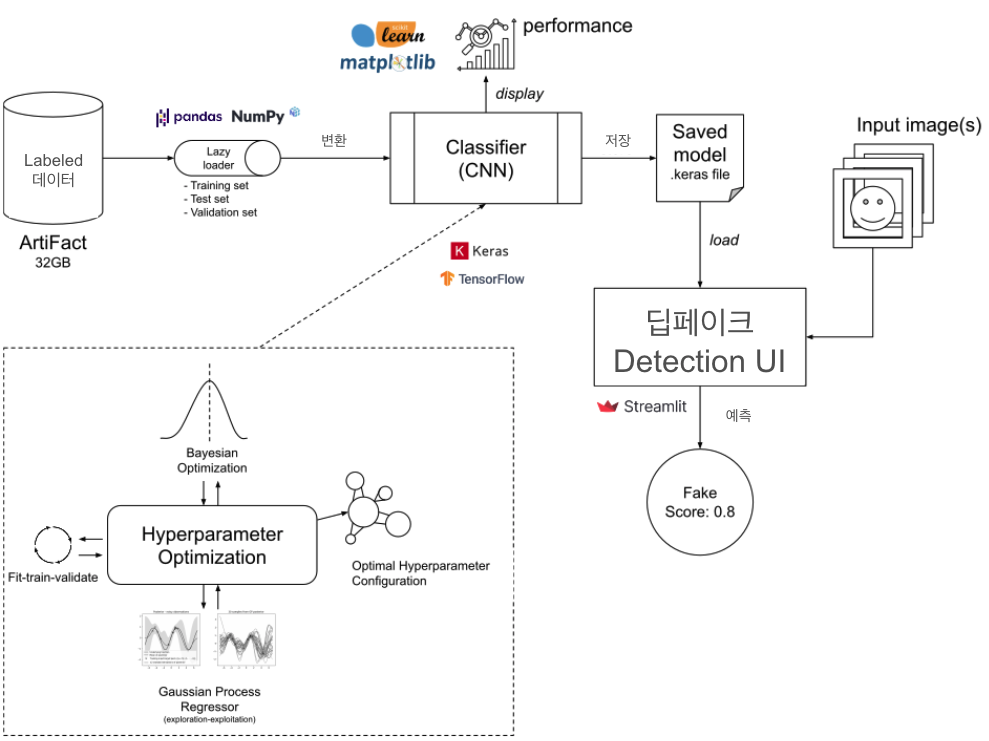
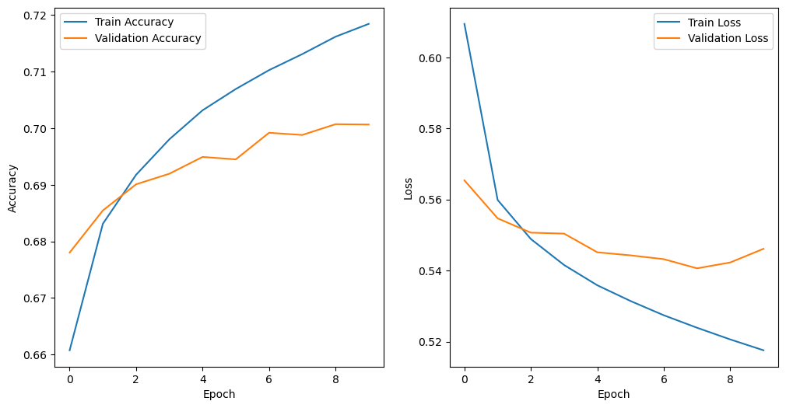
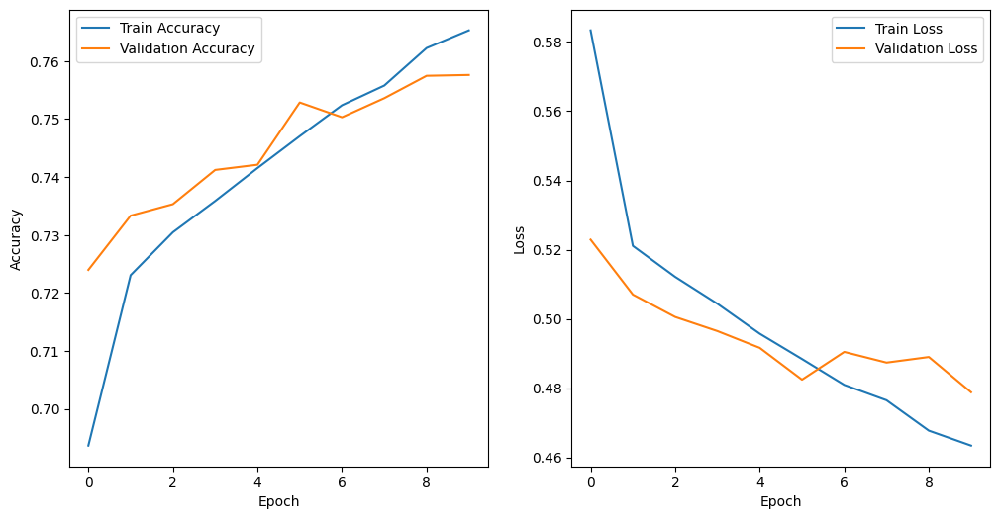
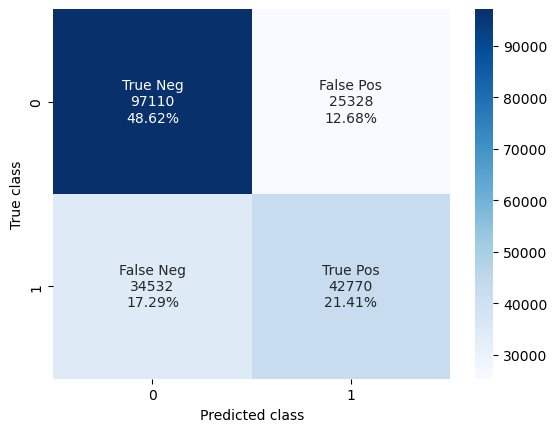
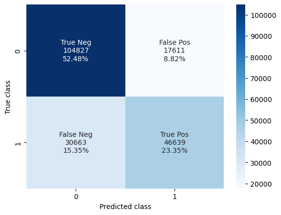
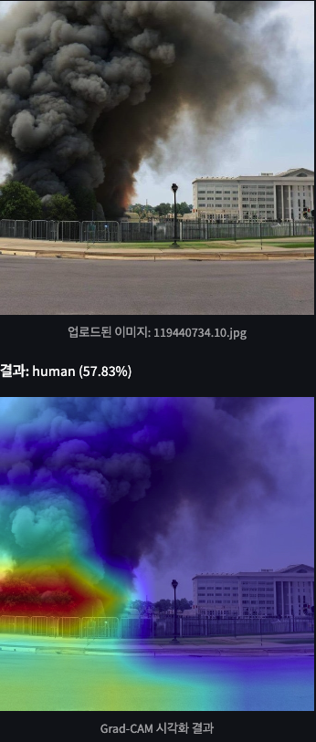
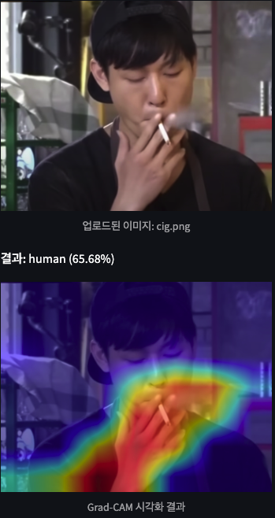

# DetectitYourself: Fake Image Detector

  

DIY는 3ninjas 팀이 개발한 생성형 인공지능(GenAI) 기반 가짜 이미지 탐지 프로그램입니다.

# 사용법

[detectityourself.streamlit.app](detectityourself.streamlit.app) 에서 데모를 사용할 수 있습니다.

# 프로젝트 아키텍쳐

이 프로젝트는 라벨이 지정된 이미지 저장소, 합성곱 신경망(CNN) 모델, 그리고 딥페이크 탐지를 위한 Streamlit 기반의 경량 UI 클라이언트로 구성됩니다.

# 데이터

[ArtiFact: Real and Fake Image Dataset](https://www.kaggle.com/datasets/awsaf49/artifact-dataset)

Artifact는 합성 및 실제 이미지를 포함하는 대규모 데이터셋입니다.

Train 데이터셋은 다양성을 고려하여, 총 25가지 합성 방법을 포함합니다. 13개의 GAN, 7개의 확산 모델(Diffusion), 5개의 기타 생성 모델이 포함됩니다.

데이터셋은 총 2,496,738개의 이미지로 구성되며, 964,989개의 실제 이미지와 1,531,749개의 합성이미지를 포함합니다. 모든 이미지의 해상도는 200x200 px 입니다.

# Model

이 프로젝트는 CNN을 사용하여 이미지를 Real = 0 또는 Fake = 1로 분류합니다.

## CNN

두 가지 CNN 아키텍쳐를 테스트하였습니다.

### LeNet-5

Simple CNN

- 총 8개의 레이어로 구성
  - 입력 레이어
  - 첫 번째 합성곱 레이어(C1)
  - 첫 번째 풀링 레이어(P1)
  - 두 번째 합성곱 레이어(C2)
  - 두 번째 풀링 레이어(P2)
  - 세 개의 완전 연결층(FC1, FC2, FC3)

### EfficientNet

- 사전 학습된 EfficientNet 모델을 기반으로 구축했습니다.
- EfficientNet은 상대적으로 적은 수의 파라미터로 높은 성능을 달성하도록 설계된 신경망 아키텍쳐입니다.
- 추가적으로 두 개의 Dense Layer와 Dropout Layer를 포함하여 성능을 최적화하였습니다.

## Hyperparameter Optimization

CNN 모델의 정확도를 최대화하기 위해 Bayesian Optimization를 활용하여 하이퍼파라미터 튜닝을 수행했습니다.

이 과정에서 Gaussian Process Regressor를 사용하여 탐색-활용 균형을 조정하였습니다.

추가적으로, 다음과 같은 설정을 적용하였습니다.

- Adamax Optimizer (Adaptive Moment Estimation)
- Categorical CrossEntropy Loss Function
- Validation Accuracy 기반 성능 평가

## Swin-Transformer

# 결과

CNN 모델을 전체 데이터셋(~250만 개 이미지)으로 10 에포크 동안 학습한 후, 테스트셋(~20만 개 이미지)에서 성능을 평가한 결과입니다.

<table>
    <tr>
        <th>Metric</th>
        <th>LeNet-5</th>
        <th>EfficientNet</th>
    </tr>
    <tr>
        <td><b>Train/Validation Accuracy</b></td>
        <td></td>
        <td></td>
    </tr>
    <tr>
        <td><b>Test Accuracy</b></td>
        <td>0.7003</td>
        <td>0.7583</td>
    </tr>
    <tr>
        <td><b>Test Loss</b></td>
        <td>0.5478</td>
        <td>0.4789</td>
    </tr>
    <tr>
        <td><b>Test Confusion Matrix</b></td>
        <td></td>
        <td></td>
    </tr>
    <tr>
        <td><b>Test Stats</b></td>
        <td></td>
        <td></td>
    </tr>
</table>

# Grad-CAM

Grad-CAM을 활용하여 모델이 이미지를 분류할 때 어떤 부분에 집중하는지 시각화하였습니다. 이를 통해 모델이 어떤 특징을 기반으로 판단을 내리는지 확인할 수 있습니다.

| 연기                            | 불                                |
| ------------------------------- | --------------------------------- |
|  |  |

위 예시에서는 연기와 불이 있는 장면과 흡연하는 장면을 대상으로 Grad-CAM을 적용하였으며, 각각의 핵심 영역(Heatmap)이 시각적으로 표시됩니다.

Grad-CAM을 활용하면 모델의 의사 결정 과정을 보다 직관적으로 분석할 수 있으며, 잘못된 판단이 발생하는 경우 오류를 식별하고 모델을 개선하는 데 도움이 됩니다.

# Frameworks

- Classifier: Python 및 Keras, KerasTuner, scikit-learn 등의 머신러닝 라이브러리를 사용하여 구현하였습니다.
- Frontend UI: Streamlit을 사용하여 빠르고 직관적인 머신러닝 및 데이터 사이언스 웹 애플리케이션을 제작하였습니다.
